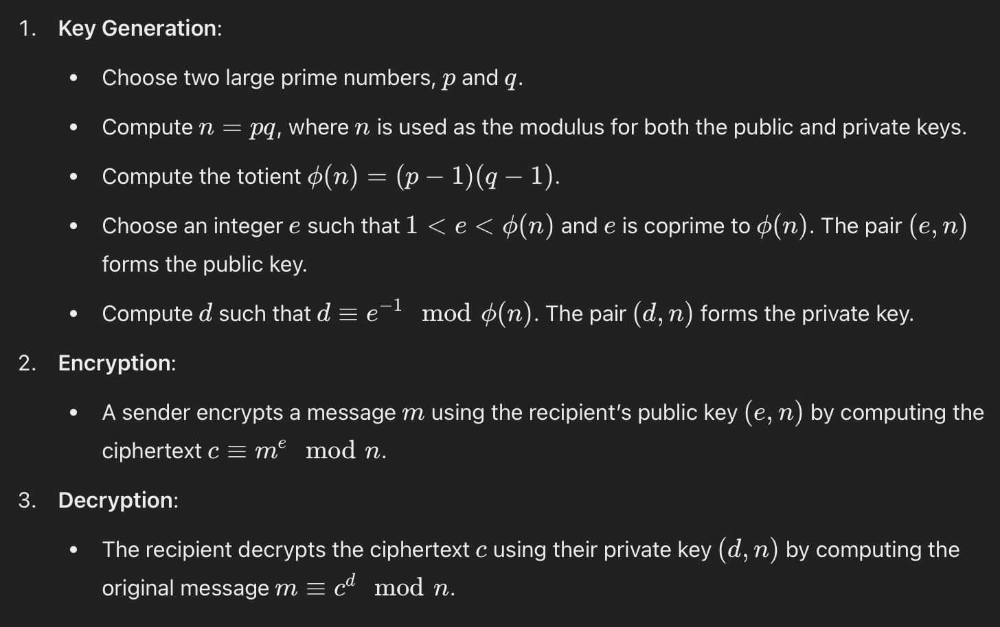

.. __what-is-rsa:

=====================
Introduction
=====================
RSA is an asymmetric cryptographic algorithm, asymmetric meaning it uses two different keys: a public key for encryption and 
a private key for decryption - this differs from symmetric cryptography, which uses the same key for both encryption and decryption.
Named after its inventors Ron Rivest, Adi Shamir, and Leonard Adleman, RSA is a foundational technology in the field of cryptography.

For this article, RSA is written to focus more on the basic encryption / decryption.

Ignoring how it works first, give me an application of RSA
-------------------------------------------------------------
Imagine you and your friend wants to have a secure way of communication, in which attackers would not have access to the conversation. You 
can make use of cryptographic algorithms, for example, RSA, to encrypt the message to be sent and decrypt the message when the message is received. 
The focus is that the encryption and decryption is only known to both you and your friend, so an attacker will not be able to decrypt the message, or 
encrypt the message and send to your friend as an imposter of you. Here comes the RSA public / private key pair:

- Public Key for Encryption:

When a sender wants to send an encrypted message to a recipient, they use the recipient's public key to encrypt the message. 
This ensures that only the recipient, who possesses the corresponding private key, can decrypt the message.

- Private Key for Decryption:

The recipient uses their private key to decrypt the message that was encrypted with their public key. 
This ensures the confidentiality of the message.

Who is using RSA?
-------------------
RSA encryption is widely used across various sectors and organizations, ranging from large multinational corporations to smaller businesses. 
Here are some examples of organizations that MAY utilize RSA for securing their digital communications and transactions:

- JPMorgan Chase & Co.: 

Uses RSA for secure online banking transactions and communications.

- Google: 

Uses RSA in securing email communications via Gmail and in the HTTPS protocol for secure browsing.

Explain the Math behind RSA
---------------------------
The security of RSA is based on the mathematical difficulty of factoring the product of two large prime numbers. 
While it is easy to multiply large primes together, it is computationally infeasible to factorize the resulting large number, 
making the system secure.

RSA usually comprises of 3 main parts, Key Gen, Enc, and Dec. The image below is generated from ChatGPT:

Conclusion
---------------------
Now that you know how RSA works and the fact that RSA is widely-used, would you be worried if I let you know that 
quantum computers have the potential to break RSA encryption? Now imagine a world without secure communication - your personal accounts 
could be easily accessed by anyone. That's is game over. 

Stay tuned tuned for more updates on how a quantum attacker can exploit RSA, making RSA in the post-quantum future.

